<h3><code>dhruvg029@github ~ $ whoami</code></h3>

<table>
    <tr>
    <td valign="top"></td>
    <td valign="top"></td>
    </tr>
</table>

  

<h3><code>dhruvg029@github ~ $ ./contributions.sh</code></h3>

  

<h3><code>dhruvg029@github ~ $ ./socials.sh</code></h3>

       

[discord]: https://discord.com/users/@750252375138238496
[linkedin]: https://www.linkedin.com/in/dhruvgupta29/
[facebook]: https://www.facebook.com/profile.php?id=100004517176239
[instagram]: https://www.instagram.com/dhruvviieee/
[kaggle]: https://www.kaggle.com/dhruvg029
[medium]: https://medium.com/@dhruvg029
[gmail]: mailto:dhruvg029@gmail.com

